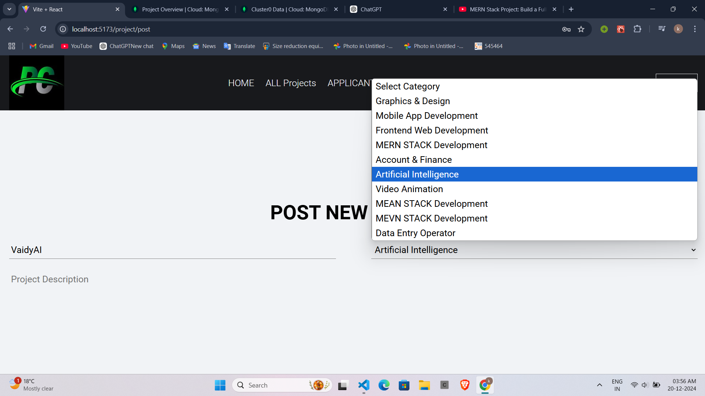
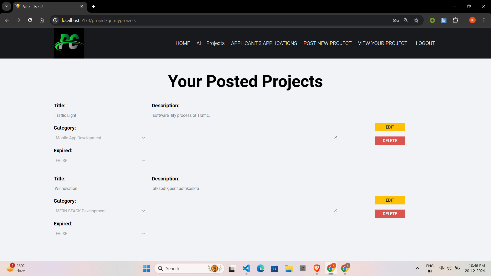
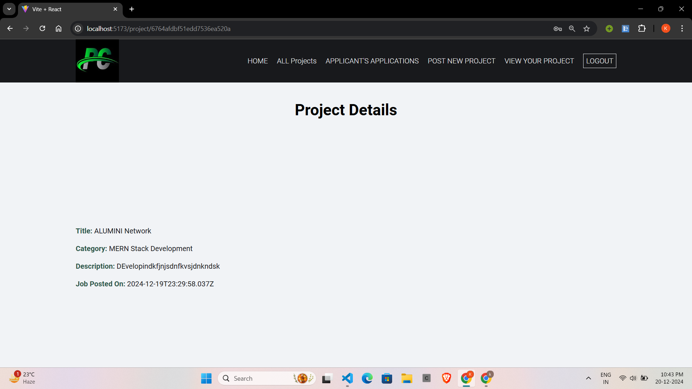
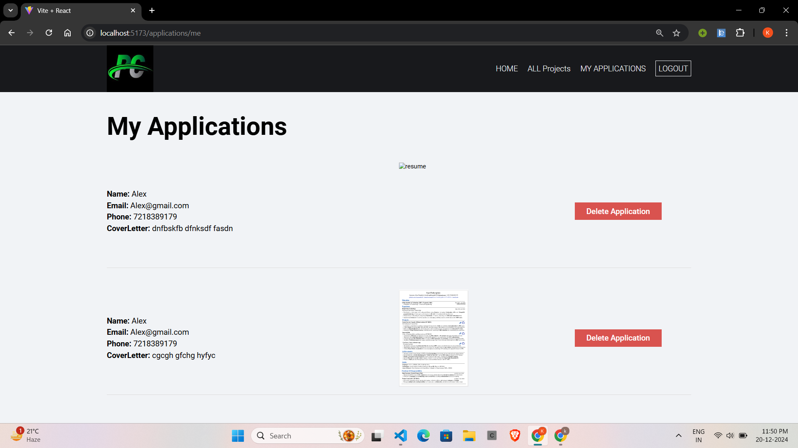
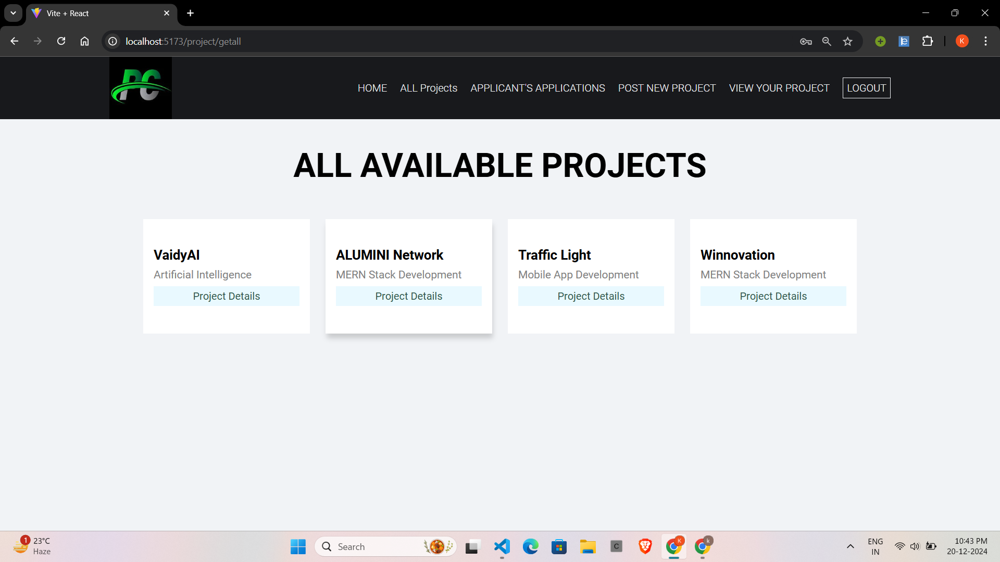
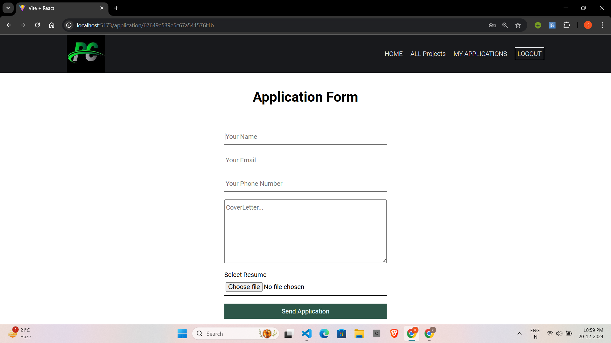

# Innovate_Hub 
In many colleges, students often have innovative project ideas but struggle to find teammates with the necessary skills or similar interests to bring their ideas to life. Conversely, there are students eager to participate in projects but lack a platform to discover suitable opportunities. This gap leads to missed opportunities for collaboration, learning, and innovation.

Innovate_Hub is a web-based portal designed to foster collaboration among college students by allowing them to share their project ideas and invite other students to join their projects. The platform aims to simplify the process of connecting students with complementary skill sets and interests, creating an ecosystem for innovation and teamwork

# Features
- Project idea uploads with detailed descriptions.
- Application system for collaborators with cover letter uploads.
- Secure dual login system with JWT-based authentication.

# ScreenShots

# - Project Head Accessible Pages

# - Project Seekers Accessible Pages

