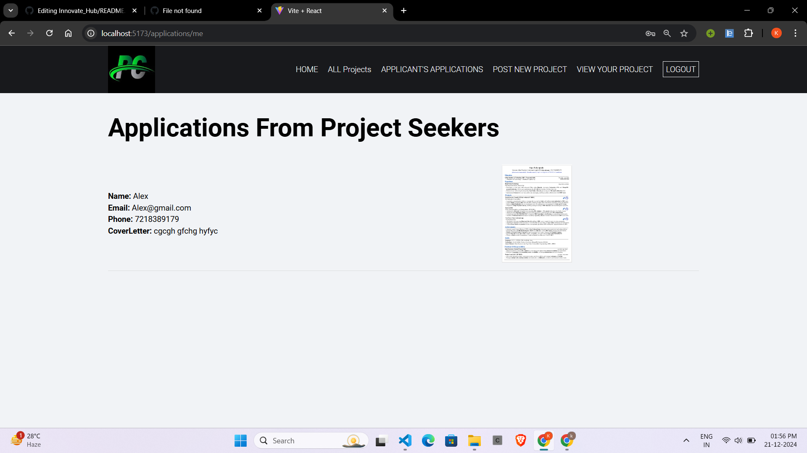
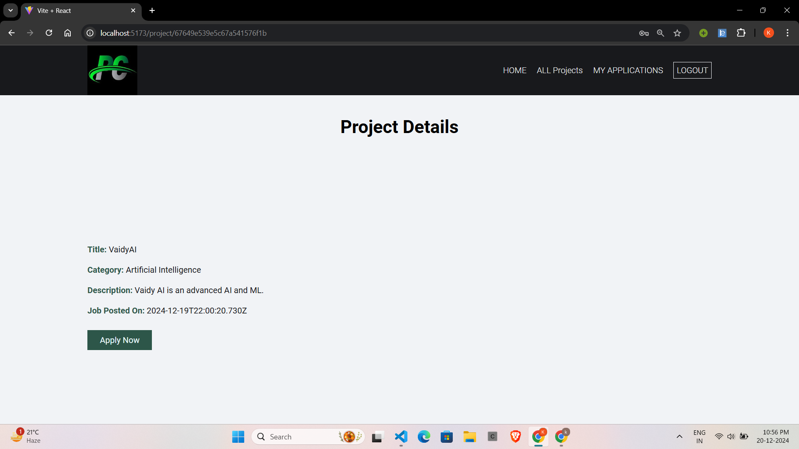

# Innovate_Hub :-  https://innovate-hub-frontend.onrender.com/
In many colleges, students often have innovative project ideas but struggle to find teammates with the necessary skills or similar interests to bring their ideas to life. Conversely, there are students eager to participate in projects but lack a platform to discover suitable opportunities. This gap leads to missed opportunities for collaboration, learning, and innovation.

Innovate_Hub is a web-based portal designed to foster collaboration among college students by allowing them to share their project ideas and invite other students to join their projects. The platform aims to simplify the process of connecting students with complementary skill sets and interests, creating an ecosystem for innovation and teamwork

# Features
- Project idea uploads with detailed descriptions.
- Application system for collaborators with cover letter uploads.
- Secure dual login system with JWT-based authentication.

# Steps to Clone and Run the Project
 # frontend
- Clone the Repository :-
  git clone https://github.com/username/repository-name.git
- Navigate to the Project Directory :-
  cd repository-name
- Install Dependencies :-
  npm install
- Run the Development Server :-
  npm run dev
 # Backend
- Navigate to the Project backend Directory :-
  cd repository-name
- Install Dependencies :-
  npm install
- Set Up Environment Variables :-
 Create a .env file in the root directory and configure the required variables as specified in .env.
  Varaibles are:-
  PORT=_____
  FRONTEND_URL=_____
  CLOUDINARY_CLIENT_NAME=_____
  CLOUDINARY_CLIENT_API=_____
  CLOUDINARY_CLIENT_SECRET=_____
  JWT_SECRET_KEY=____
  JWT_EXPIRE=____
  COOKIE_EXPIRE=___
  MONGO_URI=____
  
- Run the Development Server :-
  npm start

# ScreenShots

# - Project Head Accessible Pages

# - Project Seekers Accessible Pages

